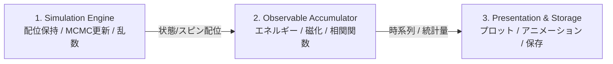

# Monte Carlo Simulation for Statistical Physics
統計力学における格子模型のモンテカルロシミュレーション

---

## 1. プロジェクト概要 (Overview)
本リポジトリは、統計力学の代表的な格子模型・スピン系・複雑系を題材としたマルコフ連鎖モンテカルロ法（MCMC: Markov Chain Monte Carlo）のシミュレーション、理論的検証、および可視化を行う学習・研究プロジェクトです。

物理モデルのハミルトニアン定式化から、詳細釣り合い条件に基づくアルゴリズム設計、有限サイズスケーリング解析や臨界現象の検証、そして将来的な C++ / Rust への高速化移植を見据えた拡張性の高いアーキテクチャ設計を実践します。

---

## 2. 設計思想・アーキテクチャ方針 (Architecture)

### 関心の分離 (Separation of Concerns)
将来的な多言語展開（Pythonプロトタイプ $\to$ C++ / Rust コアエンジン差し替え）をスムーズに行えるよう、各モデルで以下の3層構造を徹底します：



1. **Simulation Engine（状態保持・サンプリング）**:
   - 格子状態（スピン配位・グラフ構造）の保持
   - メトロポリス法、クラスターアルゴリズム、レプリカ交換等による更新
   - 外部ライブラリへの依存を最小限に抑え、純粋なアルゴリズムロジックに集中
2. **Observable Accumulator（物理量計測・統計集計）**:
   - 各モンテカルロステップ（MCS）での内部エネルギー、磁化、比熱、帯磁率、相関関数のサンプリング
   - 自己相関時間の評価、ビンニング法やジャックナイフ法による統計誤差解析
3. **Presentation & Storage（可視化・I/O）**:
   - スピン配位のリアルタイム描画や動画生成
   - 物理量の温度依存性プロット、有限サイズスケーリング解析
   - データ保存（JSON / NumPy / HDF5）

---

## 3. 実装ロードマップ (Roadmap)

本プロジェクトでは、基礎的な格子模型から出発し、連続対称性、フラストレーション、拡張アンサンブル、複雑ネットワーク、量子モンテカルロ、組合せ最適化へと段階的にステップアップします。

### Phase 1: 基礎格子模型と幾何学的フラストレーション
| ディレクトリ | 対象モデル | 主要アルゴリズム | 物理的トピック・検証項目 |
| :--- | :--- | :--- | :--- |
| `model_01_ising_2d` | **2次元正方格子イジング模型** | メトロポリス法 / Wolff法 | 二次相転移、Onsager厳密解との比較、自発磁化、Binder比 |
| `02_ising_triangular_af` | **三角格子反強磁性イジング模型** | メトロポリス法 / Wang-Landau法 | 幾何学的フラストレーション、残余エントロピー（Wannier解） |
| `03_percolation` | **パーコレーション（浸透問題）** | Hoshen-Kopelman法 | 幾何学的相転移、フラクタル次元、無限クラスター出現確率 |

### Phase 2: 連続対称性・トポロジカル相転移
| ディレクトリ | 対象モデル | 主要アルゴリズム | 物理的トピック・検証項目 |
| :--- | :--- | :--- | :--- |
| `04_xy_2d` | **2次元XY模型 ($O(2)$)** | メトロポリス法 / Wolff法 | 連続対称性、BKT転移（トポロジカル相転移）、渦・反渦対の検出 |
| `05_clock_model` | **クロック模型 ($q$-state)** | メトロポリス法 | 離散性と連続対称性の競合、$q \ge 5$ での中間相（2段階相転移） |
| `06_heisenberg_model` | **ハイゼンベルク模型 ($O(3)$)** | Overrelaxation法 / Wolff法 | 単位球面上の3成分スピン、Mermin-Wagnerの定理、スピン波 |

### Phase 3: 一次相転移と拡張アンサンブル法
| ディレクトリ | 対象モデル | 主要アルゴリズム | 物理的トピック・検証項目 |
| :--- | :--- | :--- | :--- |
| `07_potts_model` | **$q$ 状態 Potts 模型** | Swendsen-Wang法 / Wolff法 | $q \le 4$（連続転移）vs $q > 4$（一次転移・潜熱・相共存） |
| `08_wang_landau_flat` | **Wang-Landau法 / マルチカノニカル** | フラットヒストグラムサンプリング | 自由エネルギー障壁の克服、状態密度 $g(E)$ の直接計測 |

### Phase 4: ランダム系・複雑ネットワーク・最適化
| ディレクトリ | 対象モデル | 主要アルゴリズム | 物理的トピック・検証項目 |
| :--- | :--- | :--- | :--- |
| `09_spin_glass_sk` | **スピングラス（SK模型）** | レプリカ交換法 (Parallel Tempering) | 乱れとフラストレーション、多数の準安定状態、重なり度分布 |
| `10_network_ising` | **乱択グラフ・スケールフリー上のイジング** | メトロポリス法（隣接リスト表現） | Erdős-Rényi / Barabási-Albert グラフ、ハブノードによる転移温度上昇 |
| `11_simulated_annealing_tsp`| **組合せ最適化（巡回セールスマン問題）** | シミュレーテッド・アニーリング (SA) | 統計力学の最適化応用、温度降下スケジュール、2-opt遷移 |

### Phase 5: 量子モンテカルロへの橋渡し
| ディレクトリ | 対象モデル | 主要アルゴリズム | 物理的トピック・検証項目 |
| :--- | :--- | :--- | :--- |
| `12_quantum_ising_1d` | **1次元横磁場イジング模型** | 世界線モンテカルロ (QMC) | 鈴木・トロッター分解（量子-古典対応）、虚時間発展、量子相転移 |

---

## 4. プロジェクト構成 (Directory Structure)

```text
monte-carlo-simulation/
├── README.md                  # 本ファイル（プロジェクト全体概要）
├── .gitignore                 # バージョン管理除外設定
├── pyproject.toml             # 依存関係定義
├── docs/                      # 共通の理論・アルゴリズムメモ
│   ├── 00_mcmc_fundamentals.md# MCMC基礎理論、詳細釣り合い、誤差解析
│   └── 01_advanced_sampling.md# クラスター法、拡張アンサンブル、量子モンテカルロ
└── models/                    # モデル別独立ディレクトリ
    ├── model_01_ising_2d/     # 2次元イジング模型
    │   ├── README.md          # 数理定式化・理論背景・実験手順
    │   ├── src/               # エンジン・計測・可視化コード
    │   ├── tests/             # 単体テスト・詳細釣り合いの検証
    │   └── notebooks/         # 解析・アニメーション作成
    ├── model_02_ising_triangular_af/
    └── ...
```

---

## 5. 開発環境のセットアップ (Setup with uv)

本プロジェクトでは、高速かつ再現性の高いパッケージ・Python環境管理ツールとして **`uv`** を採用しています。

### 5.1. uv のインストール (macOS)
Homebrew または公式スタンドアロンインストーラで導入できます：

```bash
# Homebrew の場合
brew install uv

# または 公式インストーラの場合
curl -LsSf https://astral.sh/uv/install.sh | sh
```

### 5.2. Python 3.14 仮想環境の作成と依存関係の同期
`uv` は指定バージョンの Python 本体を自動ダウンロードして管理します。`uv.lock` がリポジトリに含まれているため、`uv sync` で完全に同じ環境が再現されます。

```bash
# プロジェクトルートで Python 3.14 仮想環境を作成
uv venv --python 3.14

# 仮想環境の有効化
source .venv/bin/activate

# ロックファイルに基づく全依存関係（開発用含む）の完全同期
uv sync --extra dev
```

### 5.3. 動作確認とテスト実行
```bash
# ライブラリ読み込みの確認
uv run python -c "import numpy, scipy, matplotlib, pytest; print('OK!')"

# テスト実行
uv run pytest
```

---

## 6. 開発ワークフロー & コミット規約

各モデルの実装は、以下のサイクルに沿って段階的に進めます：

1. **`docs: add theoretical background and formulation for <model>`**  
   ハミルトニアン、受託確率の導出、観測量の定義を各モデルの `README.md` にまとめる。
2. **`feat: add skeleton and core simulation engine for <model>`**  
   スピン配位の初期化、格子境界条件、局所更新ステップ（1 MCS）のエンジンを実装。
3. **`test: add tests for detailed balance and energy calculation`**  
   エネルギー計算の整合性、極限状態（$T \to 0$, $T \to \infty$）のテストを作成。
4. **`feat: add observables measurement and data collection`**  
   物理量のサンプリング、平衡化（thermalization）判定、統計処理を実装。
5. **`feat: add visualization and analysis scripts`**  
   相転移曲線、有限サイズスケーリング、スピンパターンのアニメーション作成。
