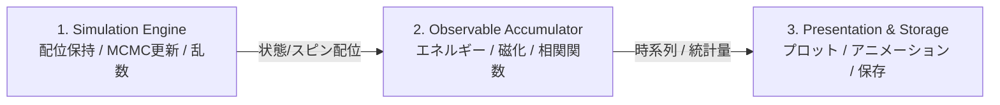

# Monte Carlo Simulation for Statistical Physics
統計力学における格子模型のモンテカルロシミュレーション

---

## 1. プロジェクト概要 (Overview)
本リポジトリは、統計力学の代表的な格子模型・スピン系・複雑系を題材としたマルコフ連鎖モンテカルロ法（MCMC: Markov Chain Monte Carlo）のシミュレーション、理論的検証、および可視化を行う学習・研究プロジェクトです。

物理モデルのハミルトニアン定式化から、詳細釣り合い条件に基づくアルゴリズム設計、有限サイズスケーリング解析や臨界現象の検証、そして将来的な C++ / Rust への高速化移植を見据えた拡張性の高いアーキテクチャ設計を実践します。

---

## 2. 設計思想・アーキテクチャ方針 (Architecture)

### 関心の分離 (Separation of Concerns)
将来的な多言語展開（Pythonプロトタイプ $\to$ C++ / Rust コアエンジン差し替え）をスムーズに行えるよう、各モデルで以下の3層構造を徹底します：



1. **Simulation Engine（状態保持・サンプリング）**:
   - 格子状態（スピン配位・グラフ構造）の保持
   - メトロポリス法、クラスターアルゴリズム、レプリカ交換等による更新
   - 外部ライブラリへの依存を最小限に抑え、純粋なアルゴリズムロジックに集中
2. **Observable Accumulator（物理量計測・統計集計）**:
   - 各モンテカルロステップ（MCS）での内部エネルギー、磁化、比熱、帯磁率、相関関数のサンプリング
   - 自己相関時間の評価、ビンニング法やジャックナイフ法による統計誤差解析
3. **Presentation & Storage（可視化・I/O）**:
   - スピン配位のリアルタイム描画や動画生成
   - 物理量の温度依存性プロット、有限サイズスケーリング解析
   - データ保存（JSON / NumPy / HDF5）

---

## 3. 実装ロードマップ (Roadmap)

本プロジェクトでは、基礎的な格子模型から出発し、連続対称性、フラストレーション、拡張アンサンブル、複雑ネットワーク、量子モンテカルロ、組合せ最適化へと段階的にステップアップします。

### Phase 1: 基礎格子模型と幾何学的フラストレーション
| ディレクトリ | 対象モデル | 主要アルゴリズム | 物理的トピック・検証項目 |
| :--- | :--- | :--- | :--- |
| `model_01_ising_2d` | **2次元正方格子イジング模型** | メトロポリス法 / Wolff法 | 二次相転移、Onsager厳密解との比較、自発磁化、Binder比 |
| `model_02_ising_triangular_af` | **三角格子反強磁性イジング模型** | メトロポリス法 / Wang-Landau法 | 幾何学的フラストレーション、残余エントロピー（Wannier解） |
| `model_03_percolation` | **パーコレーション（浸透問題）** | Hoshen-Kopelman法 | 幾何学的相転移、フラクタル次元、無限クラスター出現確率 |

### Phase 2: 連続対称性・トポロジカル相転移
| ディレクトリ | 対象モデル | 主要アルゴリズム | 物理的トピック・検証項目 |
| :--- | :--- | :--- | :--- |
| `model_04_xy_2d` | **2次元XY模型 ($O(2)$)** | メトロポリス法 / Wolff法 | 連続対称性、BKT転移（トポロジカル相転移）、渦・反渦対の検出 |
| `model_05_clock_model` | **クロック模型 ($q$-state)** | メトロポリス法 | 離散性と連続対称性の競合、$q \ge 5$ での中間相（2段階相転移） |
| `model_06_heisenberg_model` | **ハイゼンベルク模型 ($O(3)$)** | Overrelaxation法 / Wolff法 | 単位球面上の3成分スピン、Mermin-Wagnerの定理、スピン波 |

### Phase 3: 一次相転移と拡張アンサンブル法
| ディレクトリ | 対象モデル | 主要アルゴリズム | 物理的トピック・検証項目 |
| :--- | :--- | :--- | :--- |
| `model_07_potts_model` | **$q$ 状態 Potts 模型** | Swendsen-Wang法 / Wolff法 | $q \le 4$（連続転移）vs $q > 4$（一次転移・潜熱・相共存） |
| `model_08_wang_landau_flat` | **Wang-Landau法 / マルチカノニカル** | フラットヒストグラムサンプリング | 自由エネルギー障壁の克服、状態密度 $g(E)$ の直接計測 |

### Phase 4: 非平衡ダイナミクス・ヒステリシス・雪崩現象 (Non-Equilibrium Dynamics & Hysteresis)
| ディレクトリ | 対象モデル | 主要アルゴリズム | 物理的トピック・検証項目 |
| :--- | :--- | :--- | :--- |
| `model_09_dynamic_hysteresis` | **動的磁気ヒステリシス (DPT)** | 非平衡MCMC / 周期交流外場掃引 | 磁気履歴ループ ($M-h$)、動的相転移、残留磁化・保磁力の周波数依存性、エネルギー散逸 |
| `model_10_barkhausen_rfim` | **ランダム磁場イジング (RFIM) とバルクハウゼン効果** | 準静的外場駆動 / アバランシェ追跡 | 不純物ピン止め効果、磁化の雪崩ジャンプ、自己組織化臨界性、べき乗則分布 |

### Phase 5: ランダム系・生体高分子・最適化
| ディレクトリ | 対象モデル | 主要アルゴリズム | 物理的トピック・検証項目 |
| :--- | :--- | :--- | :--- |
| `model_11_spin_glass_sk` | **スピングラス（SK模型）** | レプリカ交換法 (Parallel Tempering) | 乱れとフラストレーション、多数の準安定状態、重なり度分布 |
| `model_12_protein_folding_hp` | **タンパク質フォールディング（HP格子模型）** | ピボット移動 / レプリカ交換法 | 自己回避歩行、排除体積効果、疎水性コア形成、折りたたみアニメーション |
| `model_13_simulated_annealing_tsp`| **組合せ最適化（巡回セールスマン問題）** | シミュレーテッド・アニーリング (SA) | 統計力学の最適化応用、温度降下スケジュール、2-opt遷移 |
| `model_14_network_ising` | **複雑ネットワーク上のイジング** | メトロポリス法（隣接リスト表現） | Erdős-Rényi / Barabási-Albert グラフ、ハブノードによる転移温度上昇 |

### Phase 6: 脳科学・ニューラルネットワーク・情報統計力学 (Neural Networks & Information Physics)
| ディレクトリ | 対象モデル | 主要アルゴリズム | 物理的トピック・検証項目 |
| :--- | :--- | :--- | :--- |
| `model_15_hopfield_network` | **ホップフィールド・ネットワーク** | 非同期グラディエント降下 / ゼロ温度MCMC | 連想記憶、ヘブ則、エネルギーアトラクタ、記憶容量の相転移（$\alpha_c \approx 0.138$、2024ノーベル物理学賞） |
| `model_16_boltzmann_machine` | **制限付きボルツマンマシン (RBM)** | ブロック・ギブスサンプリング / CD-$k$法 | 確率的二部スピン系、生成モデル、特徴抽出、熱ゆらぎによるMCMC画像生成（2024ノーベル物理学賞） |
| `model_17_bayesian_image_restoration` | **ベイズ推定・マルコフ確率場 (MRF)** | MCMC / MAP推定（アニーリング） | ボルツマン分布と事後分布の等価性、イジング画像ノイズ除去 |

### Phase 7: 経済物理・社会物理 (Econophysics & Sociophysics)
| ディレクトリ | 対象モデル | 主要アルゴリズム | 物理的トピック・検証項目 |
| :--- | :--- | :--- | :--- |
| `model_18_bornholdt_market` | **ボーンホフ金融市場イジング模型** | 強磁性同調 ＋ 大域的逆張り帰還 | 投資家スピン、金融バブルと暴落、ボラティリティ・クラスタリング、ファットテール |
| `model_19_wealth_distribution` | **運動論的富の交換モデル** | ランダム取引 ＋ 貯蓄率プロペンシティ | パレートの法則（べき分布 $P(w) \sim w^{-(1+\nu)}$）、ジニ係数、格差の自発的創発 |
| `model_20_schelling_segregation` | **シェリングの居住隔離モデル** | 格子空きマス移動 / メトロポリス | ミクロな寛容さとマクロな分極、イジング相分離（スピノーダル分解）、居住マップアニメーション |

### Phase 8: 素粒子・場の量子論・量子モンテカルロ (Quantum & High Energy Physics)
| ディレクトリ | 対象モデル | 主要アルゴリズム | 物理的トピック・検証項目 |
| :--- | :--- | :--- | :--- |
| `model_21_lattice_gauge_theory` | **格子ゲージ理論 ($U(1)$ / $\mathbb{Z}_2$)** | 局所熱浴法 (Heat Bath) / メトロポリス | リンク変数、プラケット作用、ウィルソンループの面積則（クォーク閉じ込め） |
| `model_22_quantum_ising_1d` | **1次元横磁場イジング模型** | 世界線モンテカルロ (QMC) | 鈴木・トロッター分解（量子-古典対応）、虚時間発展、量子相転移 |

---

## 4. プロジェクト構成 (Directory Structure)

```text
monte-carlo-simulation/
├── README.md                  # 本ファイル（プロジェクト全体概要）
├── .gitignore                 # バージョン管理除外設定
├── pyproject.toml             # 依存関係定義
├── docs/                      # 共通の理論・アルゴリズムメモ
│   ├── 00_mcmc_fundamentals.md# MCMC基礎理論、詳細釣り合い、誤差解析
│   └── 01_advanced_sampling.md# クラスター法、拡張アンサンブル、量子モンテカルロ
└── models/                    # モデル別独立ディレクトリ
    ├── model_01_ising_2d/     # 2次元イジング模型
    │   ├── README.md          # 数理定式化・理論背景・実験手順
    │   ├── src/               # エンジン・計測・可視化コード
    │   ├── tests/             # 単体テスト・詳細釣り合いの検証
    │   └── notebooks/         # 解析・アニメーション作成
    ├── model_02_ising_triangular_af/
    └── ...
```

---

## 5. 開発環境のセットアップ (Setup)

本プロジェクトでは、Python 環境管理に **`uv`**、高速計算コアの開発に **`Rust (Cargo + PyO3 + maturin)`** を採用しています。

### 5.1. 必要なツールチェーンの導入 (macOS)

#### Python & uv のインストール
```bash
# Homebrew の場合
brew install uv

# または 公式インストーラの場合
curl -LsSf https://astral.sh/uv/install.sh | sh
```

#### Rust ツールチェーンのインストール
Rust 公式インストーラ（rustup）を用いて導入します：
```bash
curl --proto '=https' --tlsv1.2 -sSf https://sh.rustup.rs | sh
source "$HOME/.cargo/env"

# バージョン確認 (1.75+ 推奨)
rustc --version
cargo --version
```

### 5.2. Python 3.14 仮想環境の作成と依存関係の同期
`uv` は指定バージョンの Python 本体を自動ダウンロードして管理します。`uv.lock` がリポジトリに含まれているため、`uv sync` で完全に同じ環境が再現されます。

```bash
# プロジェクトルートで Python 3.14 仮想環境を作成
uv venv --python 3.14

# 仮想環境の有効化
source .venv/bin/activate

# ロックファイルに基づく全依存関係（開発用・maturin 含む）の完全同期
uv sync --extra dev
```

### 5.3. Rust コアエンジンのビルド (maturin)
Rust で記述された計算コア（`crates/mc_core`）をコンパイルし、現在の Python 仮想環境に直接バインド（インポート可能化）します：

```bash
# 開発モードで Rust モジュールを即座にビルド・配置
uv run maturin develop --release --manifest-path crates/mc_core/Cargo.toml
```

### 5.4. 動作確認とテスト実行

本プロジェクトでは、コア計算の信頼性と再現性を担保するため **Rust ネイティブ単体テスト** と **Python 結合テスト** の 2 層テスト体制をとっています：

```bash
# 1. Rust コアエンジンのネイティブ単体テスト (全モデル・全クレート一括)
uv run cargo test --no-default-features

# 2. 特定のモデルのみ Rust ネイティブテストを実行する場合
# (例: 三角格子反強磁性モデル)
uv run cargo test --test test_ising_triangular --no-default-features
# (例: 2次元正方格子イジングモデル)
uv run cargo test --lib --no-default-features

# 3. Python 結合テストおよびシミュレーション全体の検証 (pytest)
uv run pytest

# 4. 特定モデルの Python テストのみ実行する場合
uv run pytest models/model_02_ising_triangular_af/tests/
```

> **Note (macOS / PyO3 での Rust ネイティブテスト実行について)**:
> `crates/mc_core/Cargo.toml` では、Python 拡張モジュール（C-extension）用の `pyo3/extension-module` がデフォルト有効になっています。この設定は「Python インタプリタ実行時に C-API シンボルが提供される」前提のため、Rust がテスト用スタンドアロンバイナリをリンクする際にシンボル未解決エラー（`_PyType_FromSpec` など）が発生します。
> したがって、Rust ネイティブで `cargo test` を実行する際は **必ず `--no-default-features` を付与し、`uv run` 経由で仮想環境（`.venv`）内の Python 共有ライブラリとリンク** させてください。

---

## 6. 開発ワークフロー & コミット規約

各モデルの実装は、以下のサイクルに沿って段階的に進めます：

1. **`docs: add theoretical background and formulation for <model>`**  
   ハミルトニアン、受託確率の導出、観測量の定義を各モデルの `README.md` にまとめる。
2. **`feat: add skeleton and core simulation engine for <model>`**  
   スピン配位の初期化、格子境界条件、局所更新ステップ（1 MCS）のエンジンを実装。
3. **`test: add tests for detailed balance and energy calculation`**  
   エネルギー計算の整合性、極限状態（$T \to 0$, $T \to \infty$）のテストを作成。
4. **`feat: add observables measurement and data collection`**  
   物理量のサンプリング、平衡化（thermalization）判定、統計処理を実装。
5. **`feat: add visualization and analysis scripts`**  
   相転移曲線、有限サイズスケーリング、スピンパターンのアニメーション作成。
